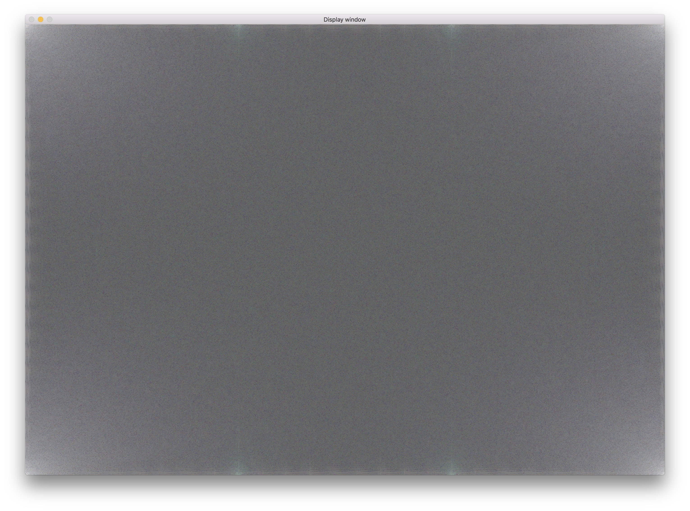
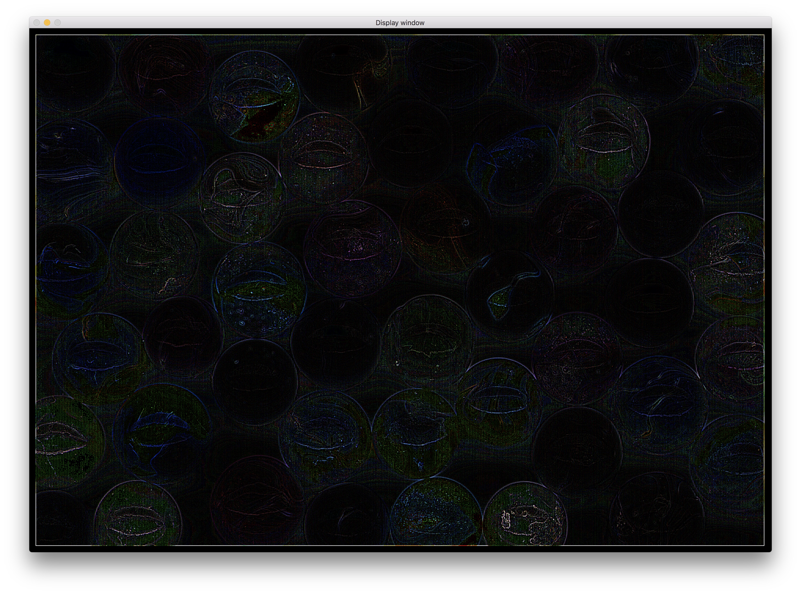
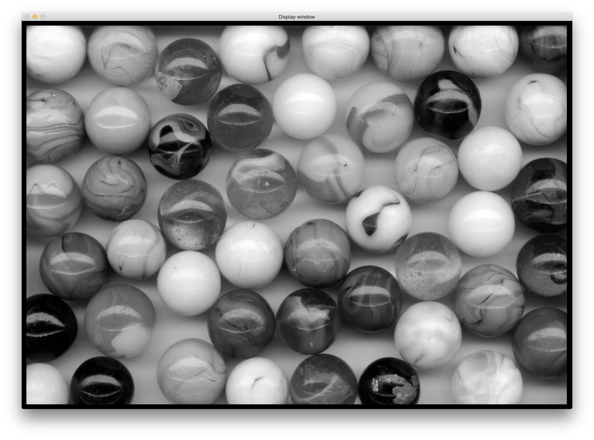
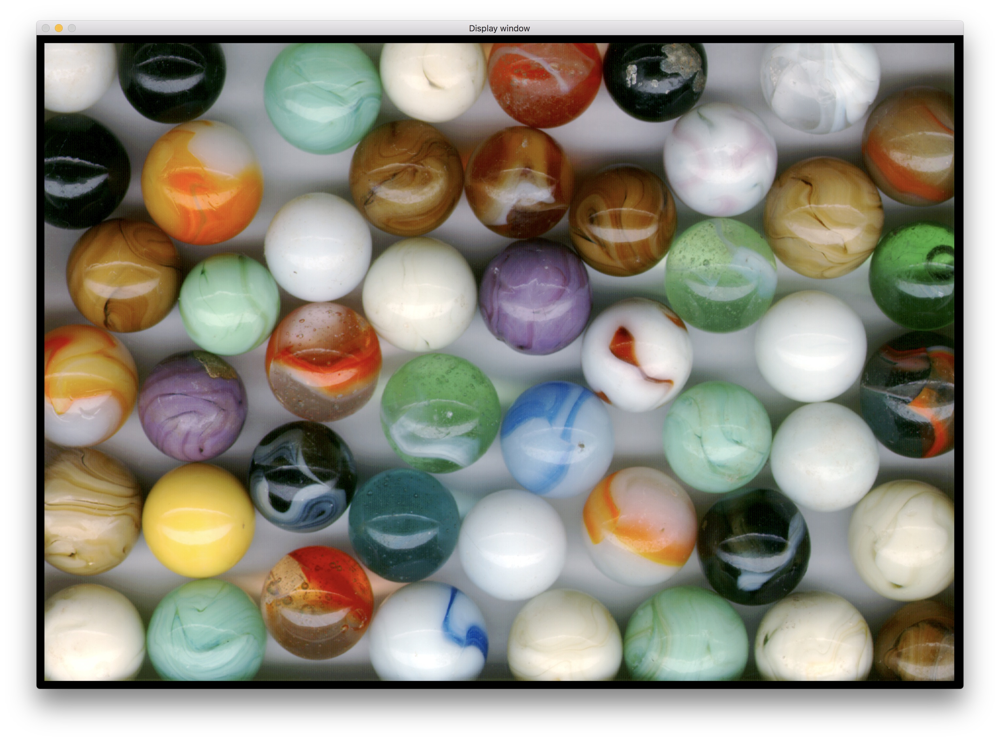
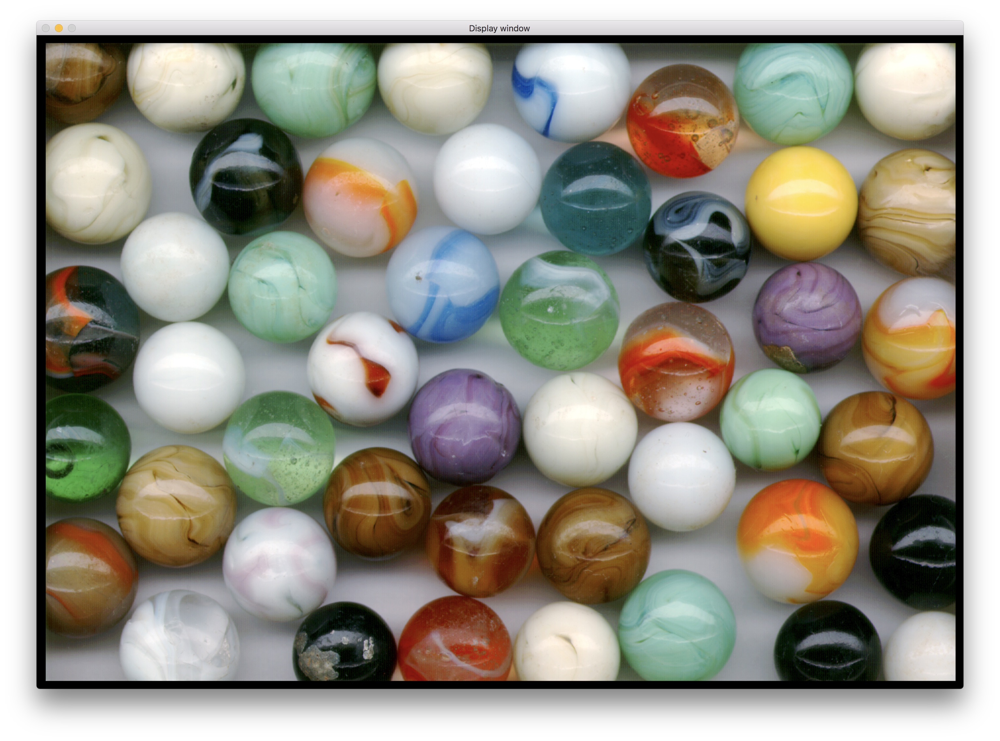
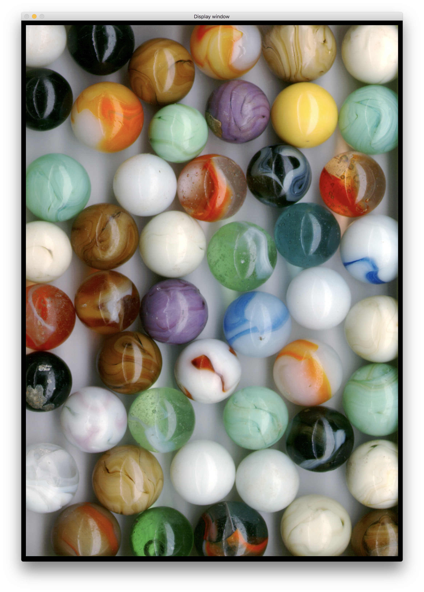

# Show
Show is a simple image editor written in C++ and OpenCL. It can display some variants of the BMP format. It supports a number of basic image transformations. All transformations are implemented as OpenCL kernels.

Basic image display

## Transformations
Here is a list of the implemented transformations

### Fourier spectrum

### Box blur

### Edges

### Grayscale

### Vertical flip

### Horizontal flip

### Rotation

