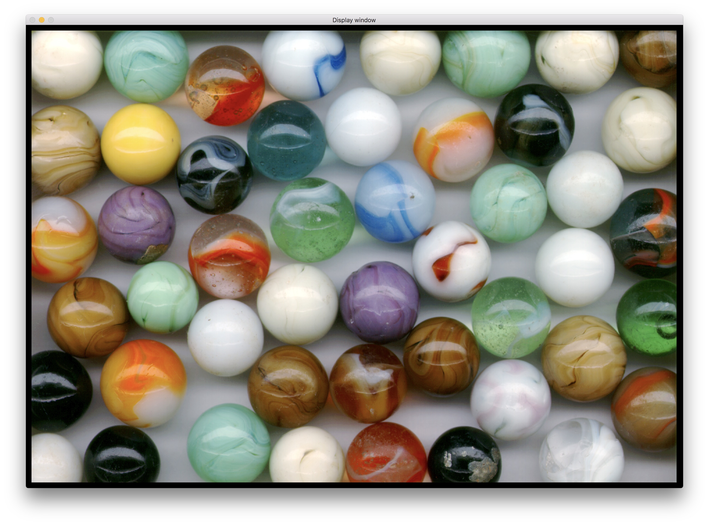

Show is a simple image editor written in C++ and OpenCL. It can display some variants of the BMP format. It supports a number of basic image transformations. All transformations are implemented as OpenCL kernels.

